# Haulvia Entity–Relationship Diagrams v1

**Source of truth:** `20260814000100_haulvia_foundation_v1.sql` plus additive Block A–E migrations `20260814000200_haulvia_block_a_commands_v1.sql` through `20260814000600_haulvia_block_e_commands_v1.sql`

**Baseline:** Approved Policy Decision Register v1.1 and State Transition Matrix v1.1

**Verified executable shape:** 110 `haulvia` base tables, 5 views, 70 named Block A+B+C+D+E command wrappers, 0 function grants to `PUBLIC`, and 0 helper grants to `service_role`

**Notation:** `||` exactly one, `o|` zero or one, `|{` one or more, `o{` zero or more

The ERD is divided into bounded views so the cardinalities remain readable. Actor, audit, notification, and other secondary foreign keys are shown in their own view instead of repeated everywhere.

## 1. Aggregate overview

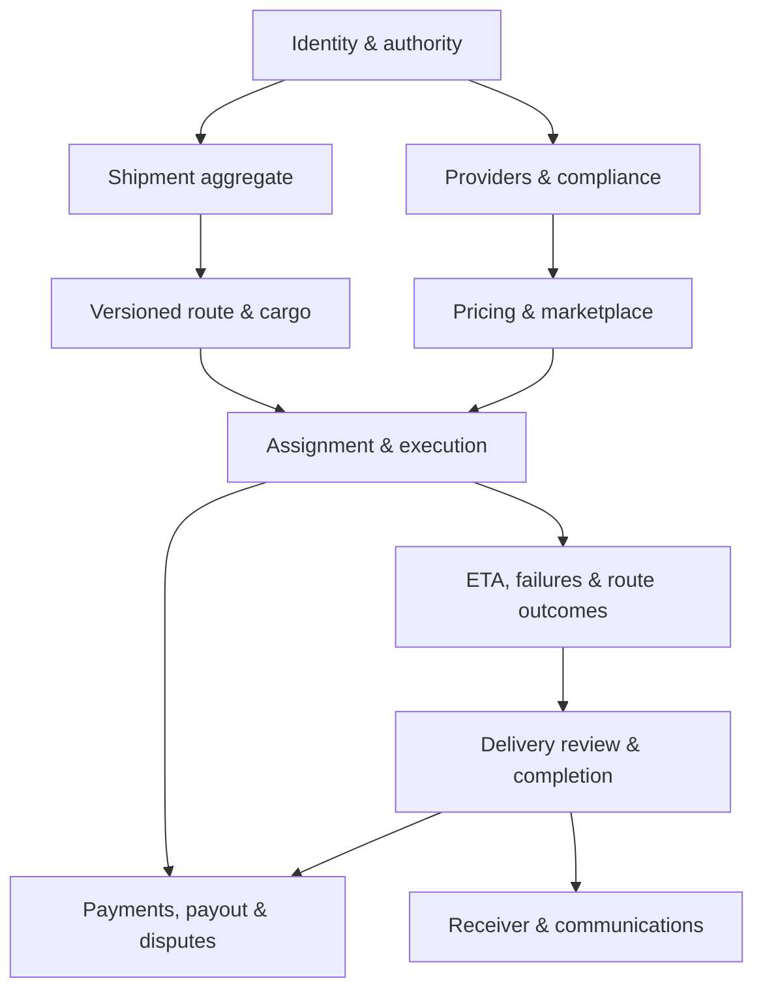
```mermaid
flowchart TD
  I["Identity & authority"] --> P["Providers & compliance"]
  I --> S["Shipment aggregate"]
  P --> M["Pricing & marketplace"]
  S --> R["Versioned route & cargo"]
  R --> X["Assignment & execution"]
  M --> X
  X --> O["ETA, failures & route outcomes"]
  O --> D["Delivery review & completion"]
  X --> F["Payments, payout & disputes"]
  D --> F
  D --> C["Receiver & communications"]
```

## 2. Identity, authority, and audit

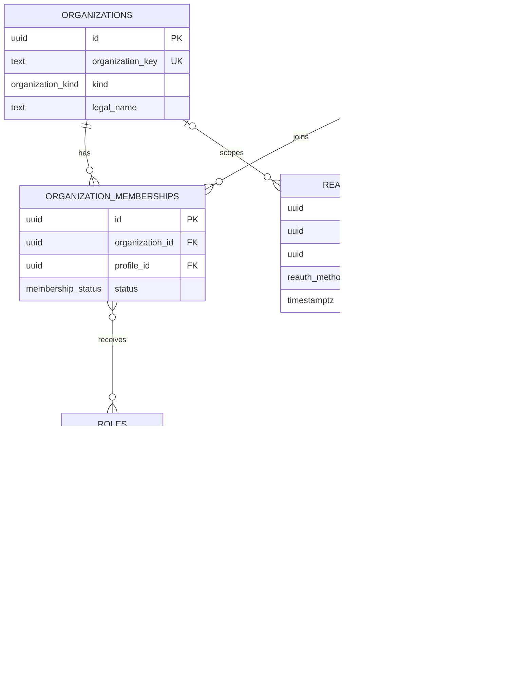
```mermaid
erDiagram
  ORGANIZATIONS {
    uuid id PK
    text organization_key UK
    organization_kind kind
    text legal_name
  }
  PROFILES {
    uuid id PK
    uuid auth_user_id UK
    text display_name
  }
  ORGANIZATION_MEMBERSHIPS {
    uuid id PK
    uuid organization_id FK
    uuid profile_id FK
    membership_status status
  }
  ROLES {
    uuid id PK
    text role_key UK
  }
  PERMISSIONS {
    uuid id PK
    text permission_key UK
    boolean is_sensitive
  }
  REAUTH_SESSIONS {
    uuid id PK
    uuid profile_id FK
    uuid organization_id FK
    reauth_method method
    timestamptz expires_at
  }
  AUDIT_EVENTS {
    uuid id PK
    uuid actor_profile_id FK
    uuid reauth_session_id FK
    text command_name
    jsonb before_value
    jsonb after_value
  }

  ORGANIZATIONS ||--o{ ORGANIZATION_MEMBERSHIPS : has
  PROFILES ||--o{ ORGANIZATION_MEMBERSHIPS : joins
  ORGANIZATION_MEMBERSHIPS }o--o{ ROLES : receives
  ROLES }o--o{ PERMISSIONS : grants
  PROFILES ||--o{ REAUTH_SESSIONS : verifies
  ORGANIZATIONS o|--o{ REAUTH_SESSIONS : scopes
  PROFILES o|--o{ AUDIT_EVENTS : acts
  REAUTH_SESSIONS o|--o{ AUDIT_EVENTS : authorizes
```

The two many-to-many relationships are implemented by `membership_roles` and `role_permissions`.

## 3. Provider onboarding and compliance

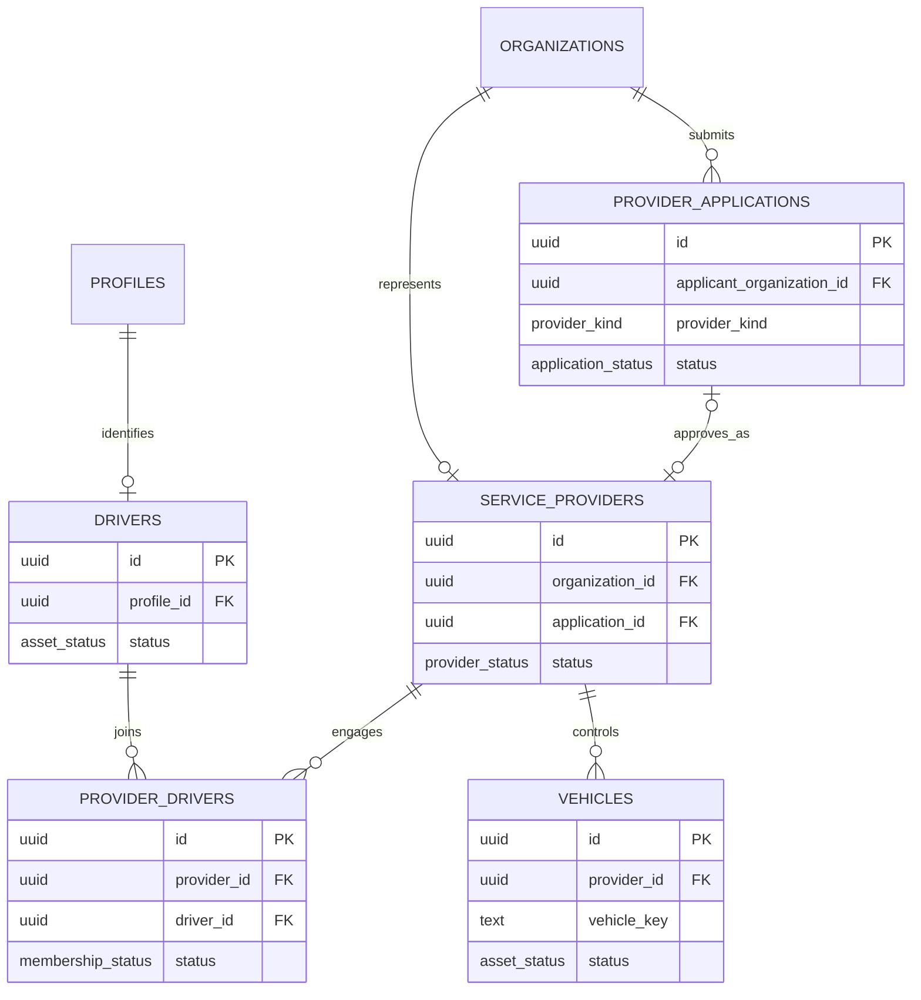
```mermaid
erDiagram
  PROVIDER_APPLICATIONS {
    uuid id PK
    uuid applicant_organization_id FK
    provider_kind provider_kind
    application_status status
  }
  SERVICE_PROVIDERS {
    uuid id PK
    uuid organization_id FK
    uuid application_id FK
    provider_status status
  }
  DRIVERS {
    uuid id PK
    uuid profile_id FK
    asset_status status
  }
  PROVIDER_DRIVERS {
    uuid id PK
    uuid provider_id FK
    uuid driver_id FK
    membership_status status
  }
  VEHICLES {
    uuid id PK
    uuid provider_id FK
    text vehicle_key
    asset_status status
  }

  ORGANIZATIONS ||--o{ PROVIDER_APPLICATIONS : submits
  PROVIDER_APPLICATIONS o|--o| SERVICE_PROVIDERS : approves_as
  ORGANIZATIONS ||--o| SERVICE_PROVIDERS : represents
  SERVICE_PROVIDERS ||--o{ PROVIDER_DRIVERS : engages
  DRIVERS ||--o{ PROVIDER_DRIVERS : joins
  SERVICE_PROVIDERS ||--o{ VEHICLES : controls
  PROFILES ||--o| DRIVERS : identifies
```

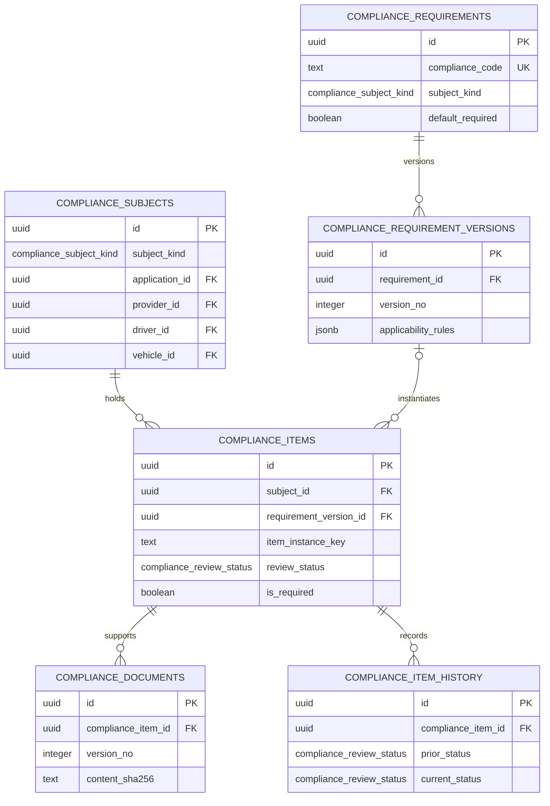
```mermaid
erDiagram
  COMPLIANCE_SUBJECTS {
    uuid id PK
    compliance_subject_kind subject_kind
    uuid application_id FK
    uuid provider_id FK
    uuid driver_id FK
    uuid vehicle_id FK
  }
  COMPLIANCE_REQUIREMENTS {
    uuid id PK
    text compliance_code UK
    compliance_subject_kind subject_kind
    boolean default_required
  }
  COMPLIANCE_REQUIREMENT_VERSIONS {
    uuid id PK
    uuid requirement_id FK
    integer version_no
    jsonb applicability_rules
  }
  COMPLIANCE_ITEMS {
    uuid id PK
    uuid subject_id FK
    uuid requirement_version_id FK
    text item_instance_key
    compliance_review_status review_status
    boolean is_required
  }
  COMPLIANCE_DOCUMENTS {
    uuid id PK
    uuid compliance_item_id FK
    integer version_no
    text content_sha256
  }
  COMPLIANCE_ITEM_HISTORY {
    uuid id PK
    uuid compliance_item_id FK
    compliance_review_status prior_status
    compliance_review_status current_status
  }

  COMPLIANCE_REQUIREMENTS ||--o{ COMPLIANCE_REQUIREMENT_VERSIONS : versions
  COMPLIANCE_SUBJECTS ||--o{ COMPLIANCE_ITEMS : holds
  COMPLIANCE_REQUIREMENT_VERSIONS o|--o{ COMPLIANCE_ITEMS : instantiates
  COMPLIANCE_ITEMS ||--o{ COMPLIANCE_DOCUMENTS : supports
  COMPLIANCE_ITEMS ||--o{ COMPLIANCE_ITEM_HISTORY : records
```

`compliance_subjects` enforces exactly one application, provider, driver, or vehicle owner. `item_instance_key` allows repeated instances such as each carried insurance policy.

## 4. Shipment and independent workflow axes

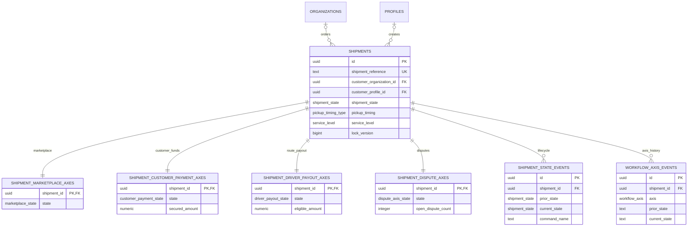
```mermaid
erDiagram
  SHIPMENTS {
    uuid id PK
    text shipment_reference UK
    uuid customer_organization_id FK
    uuid customer_profile_id FK
    shipment_state shipment_state
    pickup_timing_type pickup_timing
    service_level service_level
    bigint lock_version
  }
  SHIPMENT_MARKETPLACE_AXES {
    uuid shipment_id PK, FK
    marketplace_state state
  }
  SHIPMENT_CUSTOMER_PAYMENT_AXES {
    uuid shipment_id PK, FK
    customer_payment_state state
    numeric secured_amount
  }
  SHIPMENT_DRIVER_PAYOUT_AXES {
    uuid shipment_id PK, FK
    driver_payout_state state
    numeric eligible_amount
  }
  SHIPMENT_DISPUTE_AXES {
    uuid shipment_id PK, FK
    dispute_axis_state state
    integer open_dispute_count
  }
  SHIPMENT_STATE_EVENTS {
    uuid id PK
    uuid shipment_id FK
    shipment_state prior_state
    shipment_state current_state
    text command_name
  }
  WORKFLOW_AXIS_EVENTS {
    uuid id PK
    uuid shipment_id FK
    workflow_axis axis
    text prior_state
    text current_state
  }

  ORGANIZATIONS o|--o{ SHIPMENTS : orders
  PROFILES o|--o{ SHIPMENTS : creates
  SHIPMENTS ||--|| SHIPMENT_MARKETPLACE_AXES : marketplace
  SHIPMENTS ||--|| SHIPMENT_CUSTOMER_PAYMENT_AXES : customer_funds
  SHIPMENTS ||--|| SHIPMENT_DRIVER_PAYOUT_AXES : route_payout
  SHIPMENTS ||--|| SHIPMENT_DISPUTE_AXES : disputes
  SHIPMENTS ||--o{ SHIPMENT_STATE_EVENTS : lifecycle
  SHIPMENTS ||--o{ WORKFLOW_AXIS_EVENTS : axis_history
```

No payment, payout, dispute, or verification value is stored in `shipments.shipment_state`.

## 5. Versioned route plan and cargo allocation

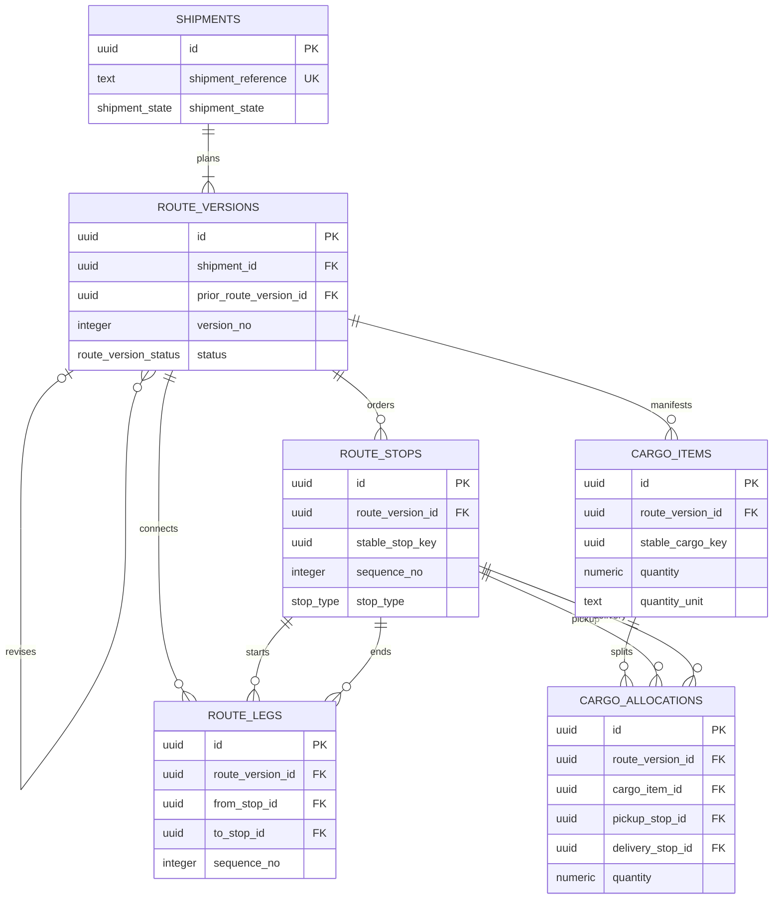
```mermaid
erDiagram
  SHIPMENTS {
    uuid id PK
    text shipment_reference UK
    shipment_state shipment_state
  }
  ROUTE_VERSIONS {
    uuid id PK
    uuid shipment_id FK
    uuid prior_route_version_id FK
    integer version_no
    route_version_status status
  }
  ROUTE_STOPS {
    uuid id PK
    uuid route_version_id FK
    uuid stable_stop_key
    integer sequence_no
    stop_type stop_type
  }
  ROUTE_LEGS {
    uuid id PK
    uuid route_version_id FK
    uuid from_stop_id FK
    uuid to_stop_id FK
    integer sequence_no
  }
  CARGO_ITEMS {
    uuid id PK
    uuid route_version_id FK
    uuid stable_cargo_key
    numeric quantity
    text quantity_unit
  }
  CARGO_ALLOCATIONS {
    uuid id PK
    uuid route_version_id FK
    uuid cargo_item_id FK
    uuid pickup_stop_id FK
    uuid delivery_stop_id FK
    numeric quantity
  }

  SHIPMENTS ||--|{ ROUTE_VERSIONS : plans
  ROUTE_VERSIONS o|--o{ ROUTE_VERSIONS : revises
  ROUTE_VERSIONS ||--o{ ROUTE_STOPS : orders
  ROUTE_VERSIONS ||--o{ ROUTE_LEGS : connects
  ROUTE_STOPS ||--o{ ROUTE_LEGS : starts
  ROUTE_STOPS ||--o{ ROUTE_LEGS : ends
  ROUTE_VERSIONS ||--o{ CARGO_ITEMS : manifests
  CARGO_ITEMS ||--o{ CARGO_ALLOCATIONS : splits
  ROUTE_STOPS ||--o{ CARGO_ALLOCATIONS : pickup
  ROUTE_STOPS ||--o{ CARGO_ALLOCATIONS : delivery
```

Every allocation is constrained to one route version, and activation verifies that allocation totals equal each cargo line's planned quantity.

## 6. Pricing publication and accepted snapshots

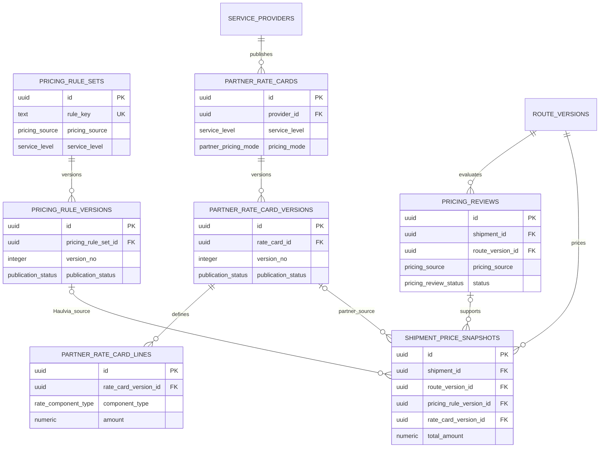
```mermaid
erDiagram
  PRICING_RULE_SETS {
    uuid id PK
    text rule_key UK
    pricing_source pricing_source
    service_level service_level
  }
  PRICING_RULE_VERSIONS {
    uuid id PK
    uuid pricing_rule_set_id FK
    integer version_no
    publication_status publication_status
  }
  PARTNER_RATE_CARDS {
    uuid id PK
    uuid provider_id FK
    service_level service_level
    partner_pricing_mode pricing_mode
  }
  PARTNER_RATE_CARD_VERSIONS {
    uuid id PK
    uuid rate_card_id FK
    integer version_no
    publication_status publication_status
  }
  PARTNER_RATE_CARD_LINES {
    uuid id PK
    uuid rate_card_version_id FK
    rate_component_type component_type
    numeric amount
  }
  PRICING_REVIEWS {
    uuid id PK
    uuid shipment_id FK
    uuid route_version_id FK
    pricing_source pricing_source
    pricing_review_status status
  }
  SHIPMENT_PRICE_SNAPSHOTS {
    uuid id PK
    uuid shipment_id FK
    uuid route_version_id FK
    uuid pricing_rule_version_id FK
    uuid rate_card_version_id FK
    numeric total_amount
  }

  PRICING_RULE_SETS ||--o{ PRICING_RULE_VERSIONS : versions
  SERVICE_PROVIDERS ||--o{ PARTNER_RATE_CARDS : publishes
  PARTNER_RATE_CARDS ||--o{ PARTNER_RATE_CARD_VERSIONS : versions
  PARTNER_RATE_CARD_VERSIONS ||--o{ PARTNER_RATE_CARD_LINES : defines
  ROUTE_VERSIONS ||--o{ PRICING_REVIEWS : evaluates
  ROUTE_VERSIONS ||--o{ SHIPMENT_PRICE_SNAPSHOTS : prices
  PRICING_RULE_VERSIONS o|--o{ SHIPMENT_PRICE_SNAPSHOTS : Haulvia_source
  PARTNER_RATE_CARD_VERSIONS o|--o{ SHIPMENT_PRICE_SNAPSHOTS : partner_source
  PRICING_REVIEWS o|--o{ SHIPMENT_PRICE_SNAPSHOTS : supports
```

The snapshot check requires exactly the appropriate rule version or rate-card version for its `pricing_source`.

## 7. Marketplace, reservation, and whole-route assignment

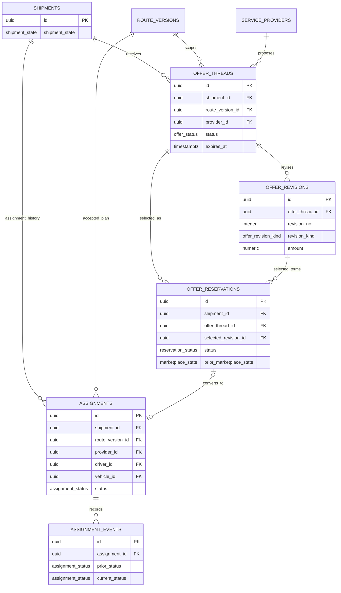
```mermaid
erDiagram
  SHIPMENTS {
    uuid id PK
    shipment_state shipment_state
  }
  OFFER_THREADS {
    uuid id PK
    uuid shipment_id FK
    uuid route_version_id FK
    uuid provider_id FK
    offer_status status
    timestamptz expires_at
  }
  OFFER_REVISIONS {
    uuid id PK
    uuid offer_thread_id FK
    integer revision_no
    offer_revision_kind revision_kind
    numeric amount
  }
  OFFER_RESERVATIONS {
    uuid id PK
    uuid shipment_id FK
    uuid offer_thread_id FK
    uuid selected_revision_id FK
    reservation_status status
    marketplace_state prior_marketplace_state
  }
  ASSIGNMENTS {
    uuid id PK
    uuid shipment_id FK
    uuid route_version_id FK
    uuid provider_id FK
    uuid driver_id FK
    uuid vehicle_id FK
    assignment_status status
  }
  ASSIGNMENT_EVENTS {
    uuid id PK
    uuid assignment_id FK
    assignment_status prior_status
    assignment_status current_status
  }

  SHIPMENTS ||--o{ OFFER_THREADS : receives
  ROUTE_VERSIONS ||--o{ OFFER_THREADS : scopes
  SERVICE_PROVIDERS ||--o{ OFFER_THREADS : proposes
  OFFER_THREADS ||--o{ OFFER_REVISIONS : revises
  OFFER_THREADS ||--o{ OFFER_RESERVATIONS : selected_as
  OFFER_REVISIONS ||--o{ OFFER_RESERVATIONS : selected_terms
  SHIPMENTS ||--o{ ASSIGNMENTS : assignment_history
  ROUTE_VERSIONS ||--o{ ASSIGNMENTS : accepted_plan
  OFFER_RESERVATIONS o|--o| ASSIGNMENTS : converts_to
  ASSIGNMENTS ||--o{ ASSIGNMENT_EVENTS : records
```

The partial unique indexes allow only one active reservation and one active assignment per shipment.

## 8. Route execution, stop evidence, and custody

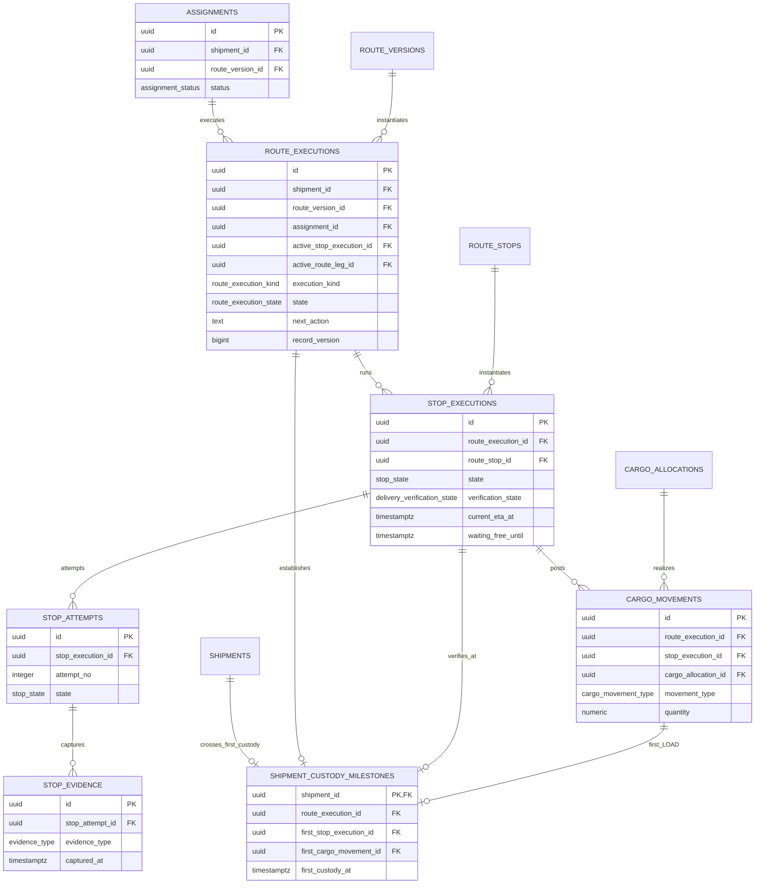
```mermaid
erDiagram
  ASSIGNMENTS {
    uuid id PK
    uuid shipment_id FK
    uuid route_version_id FK
    assignment_status status
  }
  ROUTE_EXECUTIONS {
    uuid id PK
    uuid shipment_id FK
    uuid route_version_id FK
    uuid assignment_id FK
    uuid active_stop_execution_id FK
    uuid active_route_leg_id FK
    route_execution_kind execution_kind
    route_execution_state state
    text next_action
    bigint record_version
  }
  STOP_EXECUTIONS {
    uuid id PK
    uuid route_execution_id FK
    uuid route_stop_id FK
    stop_state state
    delivery_verification_state verification_state
    timestamptz current_eta_at
    timestamptz waiting_free_until
  }
  STOP_ATTEMPTS {
    uuid id PK
    uuid stop_execution_id FK
    integer attempt_no
    stop_state state
  }
  STOP_EVIDENCE {
    uuid id PK
    uuid stop_attempt_id FK
    evidence_type evidence_type
    timestamptz captured_at
  }
  CARGO_MOVEMENTS {
    uuid id PK
    uuid route_execution_id FK
    uuid stop_execution_id FK
    uuid cargo_allocation_id FK
    cargo_movement_type movement_type
    numeric quantity
  }
  SHIPMENT_CUSTODY_MILESTONES {
    uuid shipment_id PK, FK
    uuid route_execution_id FK
    uuid first_stop_execution_id FK
    uuid first_cargo_movement_id FK
    timestamptz first_custody_at
  }

  ASSIGNMENTS ||--o{ ROUTE_EXECUTIONS : executes
  ROUTE_VERSIONS ||--o{ ROUTE_EXECUTIONS : instantiates
  ROUTE_EXECUTIONS ||--o{ STOP_EXECUTIONS : runs
  ROUTE_STOPS ||--o{ STOP_EXECUTIONS : instantiates
  STOP_EXECUTIONS ||--o{ STOP_ATTEMPTS : attempts
  STOP_ATTEMPTS ||--o{ STOP_EVIDENCE : captures
  STOP_EXECUTIONS ||--o{ CARGO_MOVEMENTS : posts
  CARGO_ALLOCATIONS ||--o{ CARGO_MOVEMENTS : realizes
  SHIPMENTS ||--o| SHIPMENT_CUSTODY_MILESTONES : crosses_first_custody
  ROUTE_EXECUTIONS ||--o| SHIPMENT_CUSTODY_MILESTONES : establishes
  STOP_EXECUTIONS ||--o| SHIPMENT_CUSTODY_MILESTONES : verifies_at
  CARGO_MOVEMENTS ||--o| SHIPMENT_CUSTODY_MILESTONES : first_LOAD
```

`route_executions` is the current position record; `route_updates` and `stop_attempt_events` preserve every position change. The milestone is a one-way boundary, while `cargo_movements` and `v_cargo_custody_balance` remain authoritative for actual quantities.

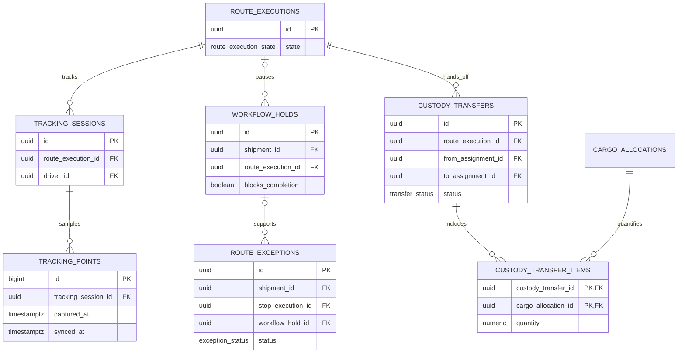
```mermaid
erDiagram
  ROUTE_EXECUTIONS {
    uuid id PK
    route_execution_state state
  }
  TRACKING_SESSIONS {
    uuid id PK
    uuid route_execution_id FK
    uuid driver_id FK
  }
  TRACKING_POINTS {
    bigint id PK
    uuid tracking_session_id FK
    timestamptz captured_at
    timestamptz synced_at
  }
  WORKFLOW_HOLDS {
    uuid id PK
    uuid shipment_id FK
    uuid route_execution_id FK
    boolean blocks_completion
  }
  ROUTE_EXCEPTIONS {
    uuid id PK
    uuid shipment_id FK
    uuid stop_execution_id FK
    uuid workflow_hold_id FK
    exception_status status
  }
  CUSTODY_TRANSFERS {
    uuid id PK
    uuid route_execution_id FK
    uuid from_assignment_id FK
    uuid to_assignment_id FK
    transfer_status status
  }
  CUSTODY_TRANSFER_ITEMS {
    uuid custody_transfer_id PK, FK
    uuid cargo_allocation_id PK, FK
    numeric quantity
  }

  ROUTE_EXECUTIONS ||--o{ TRACKING_SESSIONS : tracks
  TRACKING_SESSIONS ||--o{ TRACKING_POINTS : samples
  ROUTE_EXECUTIONS o|--o{ WORKFLOW_HOLDS : pauses
  WORKFLOW_HOLDS o|--o{ ROUTE_EXCEPTIONS : supports
  ROUTE_EXECUTIONS ||--o{ CUSTODY_TRANSFERS : hands_off
  CUSTODY_TRANSFERS ||--o{ CUSTODY_TRANSFER_ITEMS : includes
  CARGO_ALLOCATIONS ||--o{ CUSTODY_TRANSFER_ITEMS : quantifies
```

## 9. Block C ETA, failure, amendment, and route resolution

### 9.1 Downstream ETA history

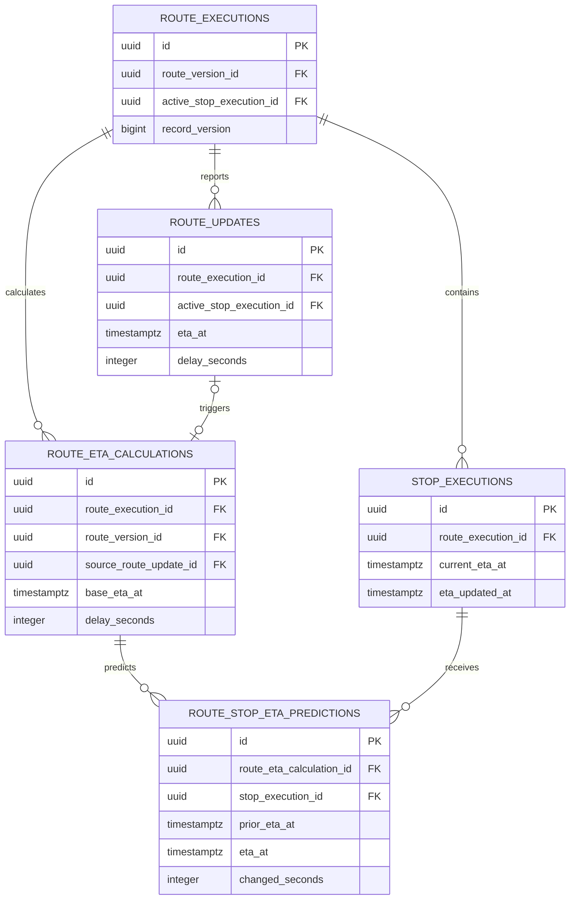
```mermaid
erDiagram
  ROUTE_EXECUTIONS {
    uuid id PK
    uuid route_version_id FK
    uuid active_stop_execution_id FK
    bigint record_version
  }
  STOP_EXECUTIONS {
    uuid id PK
    uuid route_execution_id FK
    timestamptz current_eta_at
    timestamptz eta_updated_at
  }
  ROUTE_UPDATES {
    uuid id PK
    uuid route_execution_id FK
    uuid active_stop_execution_id FK
    timestamptz eta_at
    integer delay_seconds
  }
  ROUTE_ETA_CALCULATIONS {
    uuid id PK
    uuid route_execution_id FK
    uuid route_version_id FK
    uuid source_route_update_id FK
    timestamptz base_eta_at
    integer delay_seconds
  }
  ROUTE_STOP_ETA_PREDICTIONS {
    uuid id PK
    uuid route_eta_calculation_id FK
    uuid stop_execution_id FK
    timestamptz prior_eta_at
    timestamptz eta_at
    integer changed_seconds
  }

  ROUTE_EXECUTIONS ||--o{ STOP_EXECUTIONS : contains
  ROUTE_EXECUTIONS ||--o{ ROUTE_UPDATES : reports
  ROUTE_EXECUTIONS ||--o{ ROUTE_ETA_CALCULATIONS : calculates
  ROUTE_UPDATES o|--o| ROUTE_ETA_CALCULATIONS : triggers
  ROUTE_ETA_CALCULATIONS ||--o{ ROUTE_STOP_ETA_PREDICTIONS : predicts
  STOP_EXECUTIONS ||--o{ ROUTE_STOP_ETA_PREDICTIONS : receives
```

`stop_executions.current_eta_at` is the current pointer. The calculation and every per-stop prediction remain append-only, preserving remaining drive time, expected service contribution, delay, prior ETA, and the downstream notification link.

### 9.2 Failed-stop fact and separate continuation authority

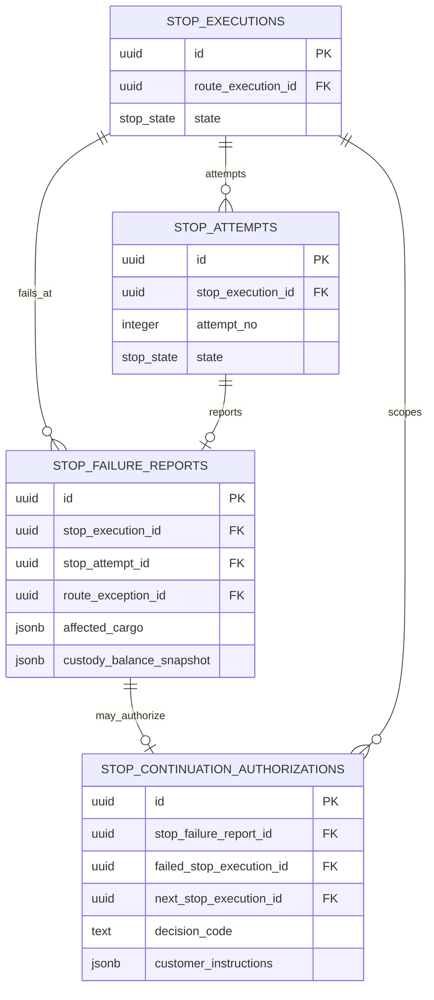
```mermaid
erDiagram
  STOP_EXECUTIONS {
    uuid id PK
    uuid route_execution_id FK
    stop_state state
  }
  STOP_ATTEMPTS {
    uuid id PK
    uuid stop_execution_id FK
    integer attempt_no
    stop_state state
  }
  STOP_FAILURE_REPORTS {
    uuid id PK
    uuid stop_execution_id FK
    uuid stop_attempt_id FK
    uuid route_exception_id FK
    jsonb affected_cargo
    jsonb custody_balance_snapshot
  }
  STOP_CONTINUATION_AUTHORIZATIONS {
    uuid id PK
    uuid stop_failure_report_id FK
    uuid failed_stop_execution_id FK
    uuid next_stop_execution_id FK
    text decision_code
    jsonb customer_instructions
  }

  STOP_EXECUTIONS ||--o{ STOP_ATTEMPTS : attempts
  STOP_EXECUTIONS ||--o{ STOP_FAILURE_REPORTS : fails_at
  STOP_ATTEMPTS ||--o| STOP_FAILURE_REPORTS : reports
  STOP_FAILURE_REPORTS ||--o| STOP_CONTINUATION_AUTHORIZATIONS : may_authorize
  STOP_EXECUTIONS ||--o{ STOP_CONTINUATION_AUTHORIZATIONS : scopes
```

Failure does not post a cargo movement or erase earlier custody. Continuation is a different immutable row; it starts the next eligible stop only after route, capacity, timing, custody, affected cargo, and customer instructions are revalidated.

### 9.3 Immutable route amendment lineage

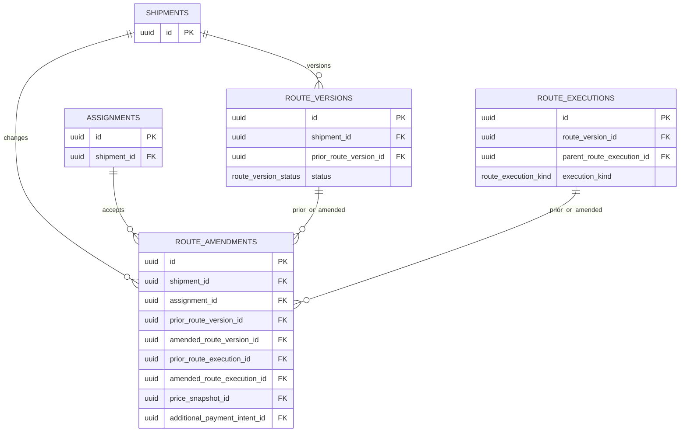
```mermaid
erDiagram
  SHIPMENTS {
    uuid id PK
  }
  ASSIGNMENTS {
    uuid id PK
    uuid shipment_id FK
  }
  ROUTE_VERSIONS {
    uuid id PK
    uuid shipment_id FK
    uuid prior_route_version_id FK
    route_version_status status
  }
  ROUTE_EXECUTIONS {
    uuid id PK
    uuid route_version_id FK
    uuid parent_route_execution_id FK
    route_execution_kind execution_kind
  }
  ROUTE_AMENDMENTS {
    uuid id PK
    uuid shipment_id FK
    uuid assignment_id FK
    uuid prior_route_version_id FK
    uuid amended_route_version_id FK
    uuid prior_route_execution_id FK
    uuid amended_route_execution_id FK
    uuid price_snapshot_id FK
    uuid additional_payment_intent_id FK
  }

  SHIPMENTS ||--o{ ROUTE_VERSIONS : versions
  SHIPMENTS ||--o{ ROUTE_AMENDMENTS : changes
  ASSIGNMENTS ||--o{ ROUTE_AMENDMENTS : accepts
  ROUTE_VERSIONS ||--o{ ROUTE_AMENDMENTS : prior_or_amended
  ROUTE_EXECUTIONS ||--o{ ROUTE_AMENDMENTS : prior_or_amended
```

The amendment row names both old and new plans and execution segments. Stable terminal stop keys, onboard cargo identity/unit/quantity, prior approved outcomes, driver acceptance, recalculated policy/price, and required additional funding are preserved before the new segment becomes active.

### 9.4 Allocation outcomes and aggregate public resolution

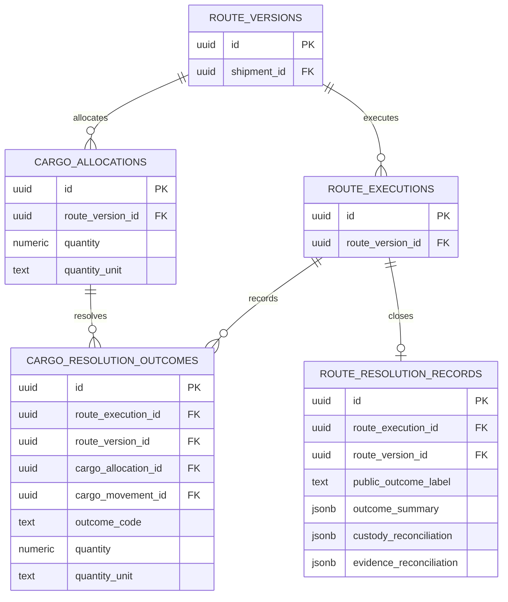
```mermaid
erDiagram
  ROUTE_VERSIONS {
    uuid id PK
    uuid shipment_id FK
  }
  ROUTE_EXECUTIONS {
    uuid id PK
    uuid route_version_id FK
  }
  CARGO_ALLOCATIONS {
    uuid id PK
    uuid route_version_id FK
    numeric quantity
    text quantity_unit
  }
  CARGO_RESOLUTION_OUTCOMES {
    uuid id PK
    uuid route_execution_id FK
    uuid route_version_id FK
    uuid cargo_allocation_id FK
    uuid cargo_movement_id FK
    text outcome_code
    numeric quantity
    text quantity_unit
  }
  ROUTE_RESOLUTION_RECORDS {
    uuid id PK
    uuid route_execution_id FK
    uuid route_version_id FK
    text public_outcome_label
    jsonb outcome_summary
    jsonb custody_reconciliation
    jsonb evidence_reconciliation
  }

  ROUTE_VERSIONS ||--o{ CARGO_ALLOCATIONS : allocates
  ROUTE_VERSIONS ||--o{ ROUTE_EXECUTIONS : executes
  CARGO_ALLOCATIONS ||--o{ CARGO_RESOLUTION_OUTCOMES : resolves
  ROUTE_EXECUTIONS ||--o{ CARGO_RESOLUTION_OUTCOMES : records
  ROUTE_EXECUTIONS ||--o| ROUTE_RESOLUTION_RECORDS : closes
```

Every active-route allocation must reconcile exactly before route resolution. The public label enumerates distinct outcome classes; `outcome_summary` groups quantities by both outcome and unit, so pieces, kilograms, litres, and other measures are never added together.

## 10. Block D delivery review, completion, and payout eligibility

### 10.1 Stop-level review and first-valid resolution

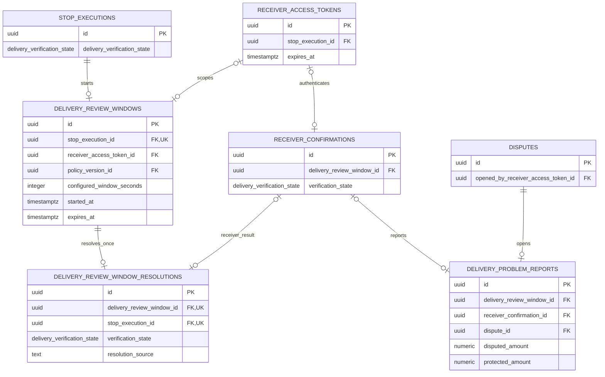
```mermaid
erDiagram
  STOP_EXECUTIONS {
    uuid id PK
    delivery_verification_state delivery_verification_state
  }
  RECEIVER_ACCESS_TOKENS {
    uuid id PK
    uuid stop_execution_id FK
    timestamptz expires_at
  }
  DELIVERY_REVIEW_WINDOWS {
    uuid id PK
    uuid stop_execution_id FK, UK
    uuid receiver_access_token_id FK
    uuid policy_version_id FK
    integer configured_window_seconds
    timestamptz started_at
    timestamptz expires_at
  }
  RECEIVER_CONFIRMATIONS {
    uuid id PK
    uuid delivery_review_window_id FK
    delivery_verification_state verification_state
  }
  DELIVERY_REVIEW_WINDOW_RESOLUTIONS {
    uuid id PK
    uuid delivery_review_window_id FK, UK
    uuid stop_execution_id FK, UK
    delivery_verification_state verification_state
    text resolution_source
  }
  DELIVERY_PROBLEM_REPORTS {
    uuid id PK
    uuid delivery_review_window_id FK
    uuid receiver_confirmation_id FK
    uuid dispute_id FK
    numeric disputed_amount
    numeric protected_amount
  }
  DISPUTES {
    uuid id PK
    uuid opened_by_receiver_access_token_id FK
  }

  STOP_EXECUTIONS ||--o| DELIVERY_REVIEW_WINDOWS : starts
  RECEIVER_ACCESS_TOKENS o|--o| DELIVERY_REVIEW_WINDOWS : scopes
  DELIVERY_REVIEW_WINDOWS ||--o| DELIVERY_REVIEW_WINDOW_RESOLUTIONS : resolves_once
  RECEIVER_ACCESS_TOKENS o|--o| RECEIVER_CONFIRMATIONS : authenticates
  RECEIVER_CONFIRMATIONS o|--o| DELIVERY_REVIEW_WINDOW_RESOLUTIONS : receiver_result
  RECEIVER_CONFIRMATIONS o|--o| DELIVERY_PROBLEM_REPORTS : reports
  DISPUTES ||--o| DELIVERY_PROBLEM_REPORTS : opens
```

The review-window row snapshots the versioned stop deadline at evidence verification. A unique stop window and unique resolution implement first-valid-commit-wins. Expiry uses a proof assessment or opens exception review; it never inserts a receiver confirmation.

### 10.2 Irreversible completion and independent provider settlement

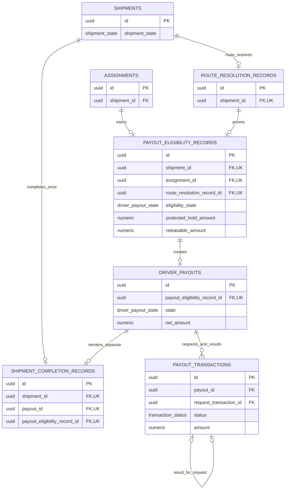
```mermaid
erDiagram
  SHIPMENTS {
    uuid id PK
    shipment_state shipment_state
  }
  ROUTE_RESOLUTION_RECORDS {
    uuid id PK
    uuid shipment_id FK, UK
  }
  ASSIGNMENTS {
    uuid id PK
    uuid shipment_id FK
  }
  PAYOUT_ELIGIBILITY_RECORDS {
    uuid id PK
    uuid shipment_id FK, UK
    uuid assignment_id FK, UK
    uuid route_resolution_record_id FK, UK
    driver_payout_state eligibility_state
    numeric protected_hold_amount
    numeric releasable_amount
  }
  DRIVER_PAYOUTS {
    uuid id PK
    uuid payout_eligibility_record_id FK, UK
    driver_payout_state state
    numeric net_amount
  }
  SHIPMENT_COMPLETION_RECORDS {
    uuid id PK
    uuid shipment_id FK, UK
    uuid payout_id FK, UK
    uuid payout_eligibility_record_id FK, UK
  }
  PAYOUT_TRANSACTIONS {
    uuid id PK
    uuid payout_id FK
    uuid request_transaction_id FK
    transaction_status status
    numeric amount
  }

  SHIPMENTS ||--o| ROUTE_RESOLUTION_RECORDS : route_resolves
  ASSIGNMENTS ||--o| PAYOUT_ELIGIBILITY_RECORDS : earns
  ROUTE_RESOLUTION_RECORDS ||--o| PAYOUT_ELIGIBILITY_RECORDS : proves
  PAYOUT_ELIGIBILITY_RECORDS ||--o| DRIVER_PAYOUTS : creates
  SHIPMENTS ||--o| SHIPMENT_COMPLETION_RECORDS : completes_once
  DRIVER_PAYOUTS ||--o| SHIPMENT_COMPLETION_RECORDS : remains_separate
  DRIVER_PAYOUTS ||--o{ PAYOUT_TRANSACTIONS : requests_and_results
  PAYOUT_TRANSACTIONS o|--o| PAYOUT_TRANSACTIONS : result_for_request
```

`shipment_completion_records` proves the physical workflow ended and is immutable. `payout_eligibility_records` retains route evidence, delivery windows, accepted price, policy, release authority, and held/releasable allocation. Provider request/result rows then advance the payout axis without altering `COMPLETED`.

## 11. Block E retry, recovery, custody, dispute, and repost lineage

### 11.1 Failed stop remains separate from retry or continuation

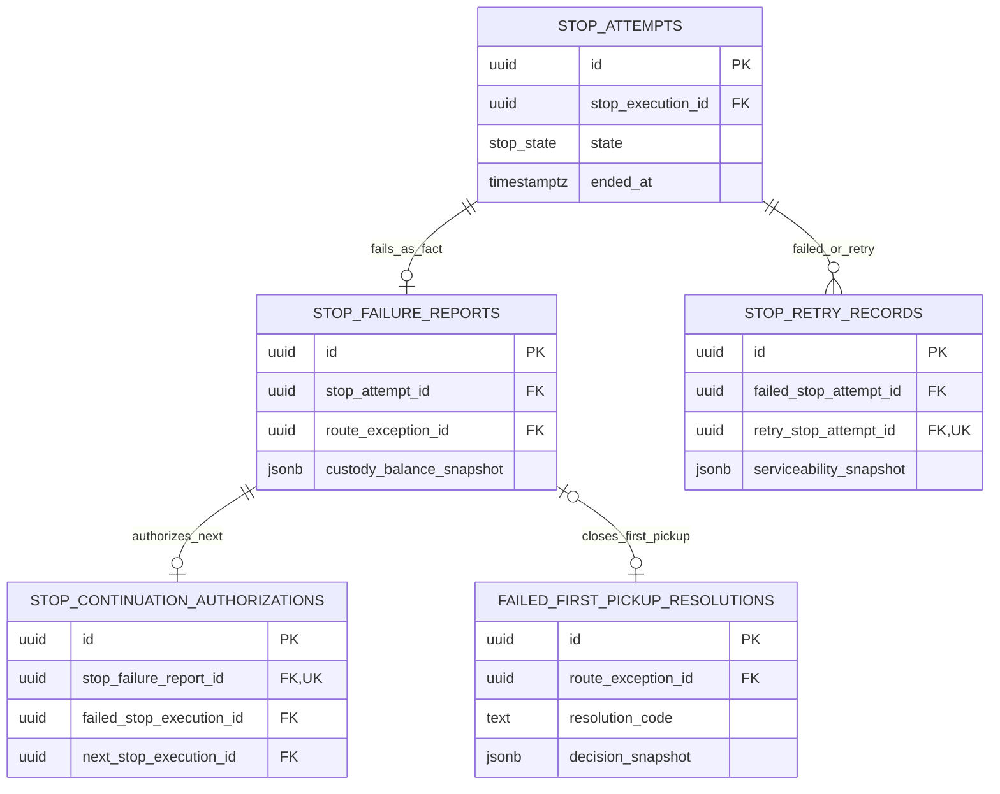
```mermaid
erDiagram
  STOP_ATTEMPTS {
    uuid id PK
    uuid stop_execution_id FK
    stop_state state
    timestamptz ended_at
  }
  STOP_FAILURE_REPORTS {
    uuid id PK
    uuid stop_attempt_id FK
    uuid route_exception_id FK
    jsonb custody_balance_snapshot
  }
  STOP_RETRY_RECORDS {
    uuid id PK
    uuid failed_stop_attempt_id FK
    uuid retry_stop_attempt_id FK, UK
    jsonb serviceability_snapshot
  }
  STOP_CONTINUATION_AUTHORIZATIONS {
    uuid id PK
    uuid stop_failure_report_id FK, UK
    uuid failed_stop_execution_id FK
    uuid next_stop_execution_id FK
  }
  FAILED_FIRST_PICKUP_RESOLUTIONS {
    uuid id PK
    uuid route_exception_id FK
    text resolution_code
    jsonb decision_snapshot
  }

  STOP_ATTEMPTS ||--o| STOP_FAILURE_REPORTS : fails_as_fact
  STOP_ATTEMPTS ||--o{ STOP_RETRY_RECORDS : failed_or_retry
  STOP_FAILURE_REPORTS ||--o| STOP_CONTINUATION_AUTHORIZATIONS : authorizes_next
  STOP_FAILURE_REPORTS o|--o| FAILED_FIRST_PICKUP_RESOLUTIONS : closes_first_pickup
```

The failed attempt never changes. E05 links it to a distinct retry attempt; E08 links its report to a separately approved next stop. E06/E07 store an explicit zero-custody first-pickup outcome rather than inferring or automatically republishing one.

### 11.2 Custody transfer and linked recovery route

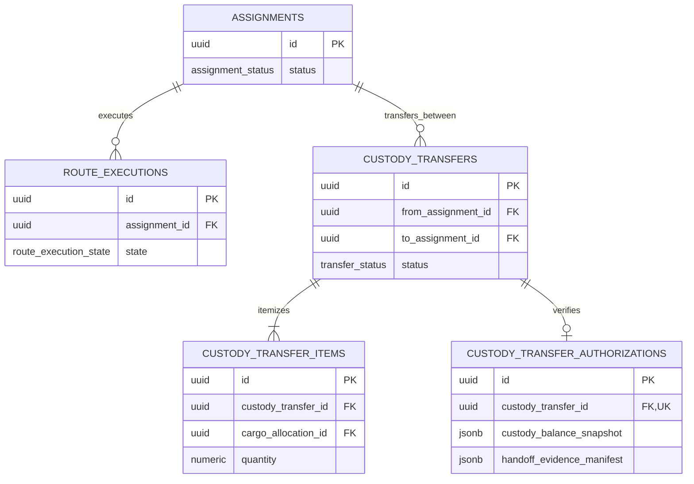
```mermaid
erDiagram
  ASSIGNMENTS {
    uuid id PK
    assignment_status status
  }
  ROUTE_EXECUTIONS {
    uuid id PK
    uuid assignment_id FK
    route_execution_state state
  }
  CUSTODY_TRANSFERS {
    uuid id PK
    uuid from_assignment_id FK
    uuid to_assignment_id FK
    transfer_status status
  }
  CUSTODY_TRANSFER_ITEMS {
    uuid id PK
    uuid custody_transfer_id FK
    uuid cargo_allocation_id FK
    numeric quantity
  }
  CUSTODY_TRANSFER_AUTHORIZATIONS {
    uuid id PK
    uuid custody_transfer_id FK, UK
    jsonb custody_balance_snapshot
    jsonb handoff_evidence_manifest
  }

  ASSIGNMENTS ||--o{ ROUTE_EXECUTIONS : executes
  ASSIGNMENTS ||--o{ CUSTODY_TRANSFERS : transfers_between
  CUSTODY_TRANSFERS ||--|{ CUSTODY_TRANSFER_ITEMS : itemizes
  CUSTODY_TRANSFERS ||--o| CUSTODY_TRANSFER_AUTHORIZATIONS : verifies
```

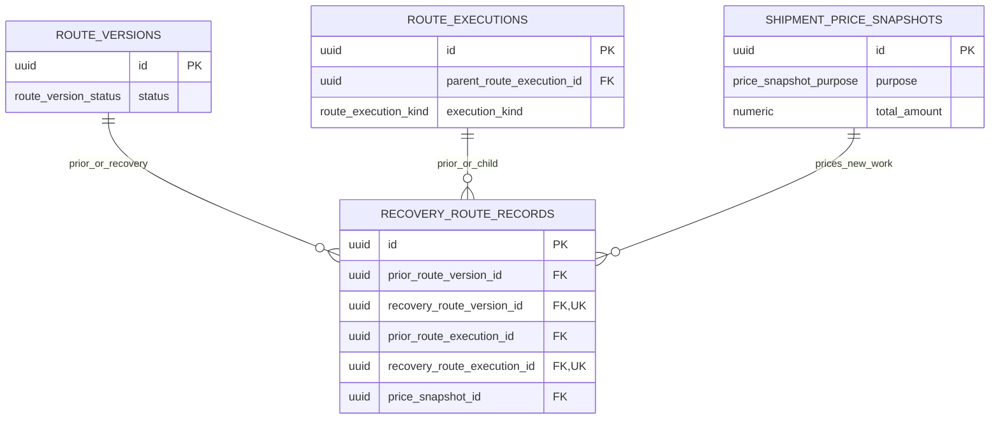
```mermaid
erDiagram
  ROUTE_VERSIONS {
    uuid id PK
    route_version_status status
  }
  ROUTE_EXECUTIONS {
    uuid id PK
    uuid parent_route_execution_id FK
    route_execution_kind execution_kind
  }
  SHIPMENT_PRICE_SNAPSHOTS {
    uuid id PK
    price_snapshot_purpose purpose
    numeric total_amount
  }
  RECOVERY_ROUTE_RECORDS {
    uuid id PK
    uuid prior_route_version_id FK
    uuid recovery_route_version_id FK, UK
    uuid prior_route_execution_id FK
    uuid recovery_route_execution_id FK, UK
    uuid price_snapshot_id FK
  }

  ROUTE_VERSIONS ||--o{ RECOVERY_ROUTE_RECORDS : prior_or_recovery
  ROUTE_EXECUTIONS ||--o{ RECOVERY_ROUTE_RECORDS : prior_or_child
  SHIPMENT_PRICE_SNAPSHOTS ||--o{ RECOVERY_ROUTE_RECORDS : prices_new_work
```

Transfer replaces the whole-route assignment only after exact manifest, eligibility, QR/PIN, photo, GPS/time, and both confirmations. The custody balance itself does not change. Recovery instead creates new route, price, and child execution records linked to preserved originals.

### 11.3 Storage and sender-return custody proof

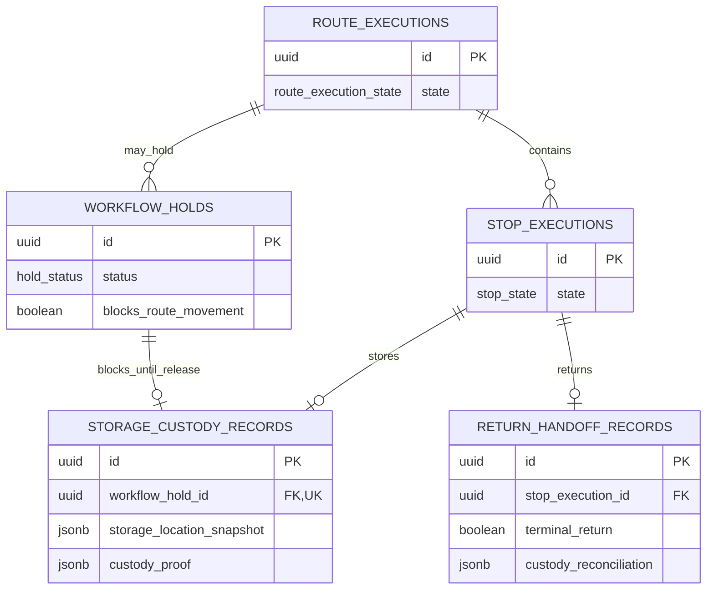
```mermaid
erDiagram
  ROUTE_EXECUTIONS {
    uuid id PK
    route_execution_state state
  }
  STOP_EXECUTIONS {
    uuid id PK
    stop_state state
  }
  WORKFLOW_HOLDS {
    uuid id PK
    hold_status status
    boolean blocks_route_movement
  }
  STORAGE_CUSTODY_RECORDS {
    uuid id PK
    uuid workflow_hold_id FK, UK
    jsonb storage_location_snapshot
    jsonb custody_proof
  }
  RETURN_HANDOFF_RECORDS {
    uuid id PK
    uuid stop_execution_id FK
    boolean terminal_return
    jsonb custody_reconciliation
  }

  ROUTE_EXECUTIONS ||--o{ STOP_EXECUTIONS : contains
  ROUTE_EXECUTIONS ||--o{ WORKFLOW_HOLDS : may_hold
  STOP_EXECUTIONS ||--o| STORAGE_CUSTODY_RECORDS : stores
  WORKFLOW_HOLDS ||--o| STORAGE_CUSTODY_RECORDS : blocks_until_release
  STOP_EXECUTIONS ||--o| RETURN_HANDOFF_RECORDS : returns
```

Both handlers append cargo movements and allocation outcomes. Storage records the complete facility/condition/access/expense/release package and holds movement. A sender return reaches terminal `RETURNED_TO_SENDER` only after the ledger proves zero remaining onboard quantity.

### 11.4 Dispute operation, resolution, and explicit resumption

```mermaid
erDiagram
  DISPUTES {
    uuid id PK
    dispute_status status
    uuid financial_hold_id FK
  }
  FINANCIAL_HOLDS {
    uuid id PK
    hold_status status
    numeric amount
  }
  DISPUTE_OPERATIONAL_CONTROLS {
    uuid id PK
    uuid dispute_id FK, UK
    uuid workflow_hold_id FK, UK
    boolean blocks_route_movement
  }
  DISPUTE_RESOLUTION_RECORDS {
    uuid id PK
    uuid dispute_id FK, UK
    uuid prior_financial_hold_id FK
    uuid retained_financial_hold_id FK
  }
  WORKFLOW_HOLDS {
    uuid id PK
    hold_status status
  }

  FINANCIAL_HOLDS o|--o{ DISPUTES : protects_amount
  DISPUTES ||--o| DISPUTE_OPERATIONAL_CONTROLS : controls_movement
  DISPUTES ||--o| DISPUTE_RESOLUTION_RECORDS : resolves_once
  WORKFLOW_HOLDS o|--o| DISPUTE_OPERATIONAL_CONTROLS : exceptional_hold
```

```mermaid
erDiagram
  WORKFLOW_HOLDS {
    uuid id PK
    hold_status status
  }
  WORKFLOW_RESUMPTION_RECORDS {
    uuid id PK
    uuid workflow_hold_id FK, UK
    uuid next_stop_execution_id FK
    text source_type
    uuid source_id
  }
  TERMINAL_SHIPMENT_REPOSTS {
    uuid id PK
    uuid source_shipment_id FK
    uuid new_shipment_id FK, UK
    uuid source_route_version_id FK
    uuid new_route_version_id FK, UK
  }
  SHIPMENTS {
    uuid id PK
    uuid source_shipment_id FK
    shipment_state shipment_state
  }

  WORKFLOW_HOLDS ||--o| WORKFLOW_RESUMPTION_RECORDS : releases_exactly
  SHIPMENTS ||--o{ TERMINAL_SHIPMENT_REPOSTS : terminal_source
  SHIPMENTS ||--o| TERMINAL_SHIPMENT_REPOSTS : new_draft
```

Money resolution never silently resumes physical movement. E15 verifies the resolved source and exact active hold, releases it, and creates a new stop attempt. Terminal reposting also preserves its source: a separate draft and draft route are copied and linked without updating the terminal row.

## 12. Customer payments, payout, disputes, and claims

```mermaid
erDiagram
  PAYMENT_INTENTS {
    uuid id PK
    uuid shipment_id FK
    uuid offer_reservation_id FK
    payment_intent_status status
    numeric amount
  }
  PAYMENT_TRANSACTIONS {
    uuid id PK
    uuid payment_intent_id FK
    payment_transaction_type transaction_type
    transaction_status status
    numeric amount
  }
  DRIVER_PAYOUTS {
    uuid id PK
    uuid shipment_id FK
    uuid assignment_id FK
    driver_payout_state state
    numeric net_amount
  }
  PAYOUT_TRANSACTIONS {
    uuid id PK
    uuid payout_id FK
    uuid request_transaction_id FK
    transaction_status status
    numeric amount
  }
  FINANCIAL_HOLDS {
    uuid id PK
    uuid shipment_id FK
    uuid payment_intent_id FK
    uuid payout_id FK
    hold_status status
    numeric amount
  }
  FINANCIAL_ADJUSTMENTS {
    uuid id PK
    uuid shipment_id FK
    uuid route_execution_id FK
    uuid stop_execution_id FK
    uuid cargo_item_id FK
    financial_adjustment_type adjustment_type
    numeric amount
    uuid reauth_session_id FK
  }

  SHIPMENTS ||--o{ PAYMENT_INTENTS : funds
  OFFER_RESERVATIONS o|--o{ PAYMENT_INTENTS : funds_selection
  PAYMENT_INTENTS ||--o{ PAYMENT_TRANSACTIONS : records
  SHIPMENTS ||--o{ DRIVER_PAYOUTS : pays_route
  ASSIGNMENTS ||--o| DRIVER_PAYOUTS : earns
  DRIVER_PAYOUTS ||--o{ PAYOUT_TRANSACTIONS : attempts
  SHIPMENTS ||--o{ FINANCIAL_HOLDS : protects
  PAYMENT_INTENTS o|--o{ FINANCIAL_HOLDS : holds_customer_funds
  DRIVER_PAYOUTS o|--o{ FINANCIAL_HOLDS : holds_payout
  SHIPMENTS ||--o{ FINANCIAL_ADJUSTMENTS : adjusts
```

```mermaid
erDiagram
  SHIPMENTS {
    uuid id PK
    shipment_state shipment_state
  }
  DISPUTES {
    uuid id PK
    uuid shipment_id FK
    uuid stop_execution_id FK
    uuid cargo_item_id FK
    uuid opened_by_receiver_access_token_id FK
    dispute_status status
    numeric disputed_amount
  }
  DISPUTE_EVENTS {
    uuid id PK
    uuid dispute_id FK
    dispute_status current_status
    jsonb financial_allocation
  }
  CLAIMS {
    uuid id PK
    uuid shipment_id FK
    uuid stop_execution_id FK
    uuid cargo_item_id FK
    claim_status status
  }
  CLAIM_EVENTS {
    uuid id PK
    uuid claim_id FK
    claim_status current_status
    jsonb evidence_manifest
  }
  FINANCIAL_HOLDS {
    uuid id PK
    uuid shipment_id FK
    hold_status status
    numeric amount
  }

  SHIPMENTS ||--o{ DISPUTES : may_open
  DISPUTES ||--o{ DISPUTE_EVENTS : records
  FINANCIAL_HOLDS o|--o{ DISPUTES : protects
  SHIPMENTS ||--o{ CLAIMS : may_open
  CLAIMS ||--o{ CLAIM_EVENTS : records
  FINANCIAL_HOLDS o|--o{ CLAIMS : protects
```

Disputes and claims can affect financial/workflow holds without rewriting shipment or cargo location. Claims may remain active after a shipment is operationally complete.

## 13. Block A+B payment/cancellation evidence and shared outbox

```mermaid
erDiagram
  ORGANIZATIONS {
    uuid id PK
  }
  PROFILES {
    uuid id PK
  }
  SHIPMENTS {
    uuid id PK
    shipment_state shipment_state
  }
  ROUTE_VERSIONS {
    uuid id PK
    uuid shipment_id FK
  }
  POLICY_VERSIONS {
    uuid id PK
    integer version_no
  }
  CUSTOMER_PAYMENT_METHOD_REFS {
    uuid id PK
    uuid customer_organization_id FK
    uuid customer_profile_id FK
    text external_provider
    text external_reference
    timestamptz verified_at
  }
  SHIPMENT_CANCELLATION_SNAPSHOTS {
    uuid id PK
    uuid shipment_id FK
    uuid route_version_id FK
    uuid policy_version_id FK
    shipment_state prior_shipment_state
    marketplace_state prior_marketplace_state
    customer_payment_state prior_payment_state
  }
  WORKFLOW_JOBS {
    uuid id PK
    uuid shipment_id FK
    text job_code
    text status
    timestamptz run_after
  }
  ASSIGNMENTS {
    uuid id PK
    uuid shipment_id FK
  }
  ROUTE_EXECUTIONS {
    uuid id PK
    uuid assignment_id FK
  }
  PRE_CUSTODY_FINANCIAL_DECISIONS {
    uuid id PK
    uuid shipment_id FK
    uuid assignment_id FK
    uuid route_execution_id FK
    uuid policy_version_id FK
    numeric cancellation_charge_amount
    numeric customer_refund_amount
    numeric driver_compensation_amount
  }

  ORGANIZATIONS o|--o{ CUSTOMER_PAYMENT_METHOD_REFS : owns
  PROFILES o|--o{ CUSTOMER_PAYMENT_METHOD_REFS : owns
  SHIPMENTS ||--o{ SHIPMENT_CANCELLATION_SNAPSHOTS : retains
  ROUTE_VERSIONS o|--o{ SHIPMENT_CANCELLATION_SNAPSHOTS : captures_route
  POLICY_VERSIONS o|--o{ SHIPMENT_CANCELLATION_SNAPSHOTS : governs
  SHIPMENTS o|--o{ WORKFLOW_JOBS : schedules
  SHIPMENTS ||--o{ PRE_CUSTODY_FINANCIAL_DECISIONS : preserves
  ASSIGNMENTS ||--o{ PRE_CUSTODY_FINANCIAL_DECISIONS : closes
  ROUTE_EXECUTIONS o|--o{ PRE_CUSTODY_FINANCIAL_DECISIONS : scopes
  POLICY_VERSIONS ||--o{ PRE_CUSTODY_FINANCIAL_DECISIONS : governs
```

Raw card or bank credentials are never stored. The command layer validates a verified external method reference, retains cancellation/custody evidence append-only, and queues delayed settlement or other work transactionally with the business decision. Block C adds the ETA, failure/continuation, amendment, cargo-outcome, and route-resolution records shown in Section 9. Block D adds the review, completion, payout eligibility, provider request/result, and adjustment lineage shown in Section 10. Block E adds retry, transfer, recovery, storage/return, dispute control/resolution, resumption, and terminal-copy lineage shown in Section 11. Payment-provider settlement still progresses on its independent axis.

## 14. Receiver access and communications

```mermaid
erDiagram
  SHIPMENTS {
    uuid id PK
    text shipment_reference UK
  }
  STOP_EXECUTIONS {
    uuid id PK
    uuid shipment_id FK
    delivery_verification_state verification_state
  }
  RECEIVER_ACCESS_TOKENS {
    uuid id PK
    uuid shipment_id FK
    uuid stop_execution_id FK
    text token_hash UK
    timestamptz expires_at
  }
  RECEIVER_CONFIRMATIONS {
    uuid id PK
    uuid stop_execution_id FK
    uuid receiver_access_token_id FK
    uuid delivery_review_window_id FK
    delivery_verification_state verification_state
  }
  DELIVERY_REVIEW_WINDOWS {
    uuid id PK
    uuid stop_execution_id FK, UK
    uuid receiver_access_token_id FK
    timestamptz expires_at
  }
  DELIVERY_REVIEW_WINDOW_RESOLUTIONS {
    uuid id PK
    uuid delivery_review_window_id FK, UK
    delivery_verification_state verification_state
  }
  SHIPMENT_MESSAGES {
    uuid id PK
    uuid shipment_id FK
    uuid stop_execution_id FK
    uuid receiver_token_id FK
  }
  NOTIFICATION_EVENTS {
    uuid id PK
    uuid shipment_id FK
    uuid receiver_access_token_id FK
    notification_status status
  }

  SHIPMENTS ||--o{ STOP_EXECUTIONS : contains
  STOP_EXECUTIONS ||--o{ RECEIVER_ACCESS_TOKENS : grants
  STOP_EXECUTIONS ||--o| DELIVERY_REVIEW_WINDOWS : starts
  RECEIVER_ACCESS_TOKENS o|--o| DELIVERY_REVIEW_WINDOWS : scopes
  DELIVERY_REVIEW_WINDOWS ||--o| DELIVERY_REVIEW_WINDOW_RESOLUTIONS : resolves_once
  RECEIVER_ACCESS_TOKENS o|--o{ RECEIVER_CONFIRMATIONS : authenticates
  STOP_EXECUTIONS ||--o{ RECEIVER_CONFIRMATIONS : receives
  SHIPMENTS ||--o{ SHIPMENT_MESSAGES : communicates
  STOP_EXECUTIONS o|--o{ SHIPMENT_MESSAGES : scopes
  SHIPMENTS o|--o{ NOTIFICATION_EVENTS : emits
  RECEIVER_ACCESS_TOKENS o|--o{ NOTIFICATION_EVENTS : addresses
```

The token carries only a hashed secret and stop-limited permission payload. Receiver access does not grant pricing, payment, route edit, or cancellation rights.

## 15. Route resolution, dispute control, completion review, and finance remain separate

```mermaid
flowchart TD
  R["Terminal route + stop outcomes"] --> G["Block C route-resolution gate"]
  C["Custody balance = 0"] --> G
  E["Required stop evidence verified"] --> G
  H["No blocking exception or hold"] --> G
  G --> D["DELIVERED: aggregate route resolved"]
  D --> V["Versioned stop review windows"]
  V --> O["COMPLETED: immutable physical finish"]
  O --> P["Payout READY / HELD / PROCESSING / PAID"]
  O --> Q["Dispute or claim remains separate"]
  Q --> F["Evidence and disputed funds resolve independently"]
```

This final view is the central separation rule. Block C can resolve the route to internal `DELIVERED` while a contactless stop still awaits its independent receiver outcome. Block D resolves every applicable window, records release authority and payout eligibility, and then makes `COMPLETED` irreversible. Block E handles post-custody inability through linked transfer/recovery/storage/return records and treats any dispute movement hold as a separate, justified, explicitly released workflow fact. Financial settlement and later disputes, refunds, adjustments, claims, or terminal reposts never rewrite physical route or custody history.
